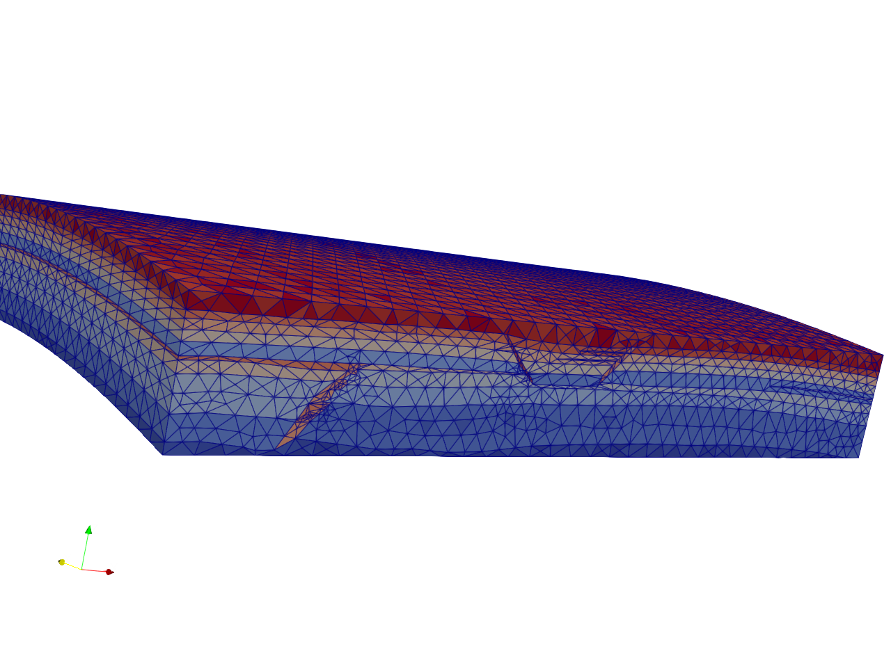

.. image:: images/IFPENVF_quadri.jpg
   :scale: 8 %
   :align: right

.. _SPE11:

######################################
SPE11 meshes
######################################

`3D meshes frome the 11th Society of Petroleum Engineers Comparative Solution Project <https://www.spe.org/en/csp/>`_

`11th SPE CSPGithub Project <https://github.com/Simulation-Benchmarks/11thSPE-CSP>`_

Command to generate the geometry for the meshing step with a given mesh size
.. code-block:: sh
   # generates spe11c.geo with a characteristic mesh size of 250m to be used around all points
   python3 make_spe11c_geo.py --mesh-size 250

You can open the geometry files with `gmsh`, or let it create a mesh directly via the command line with

.. code-block:: sh
   # command to generate tetra based  mesh spe11c.msh from a geometry with the gmsh meshing tool
   gmsh -3 FILENAME.geo  # creates a 3d mesh in the file FILENAME.msh

Command to generate hexa based meshes
.. code-block:: sh
   # generate a 200x200x200 mesh for variant C in the file spe11c_structured.msh
   python3 make_structured_mesh.py --variant C -nx 200 -ny 200 -nz 200

   

.. image:: images/spe11-hexa.png
   :scale: 80 %
   :align: center
   

